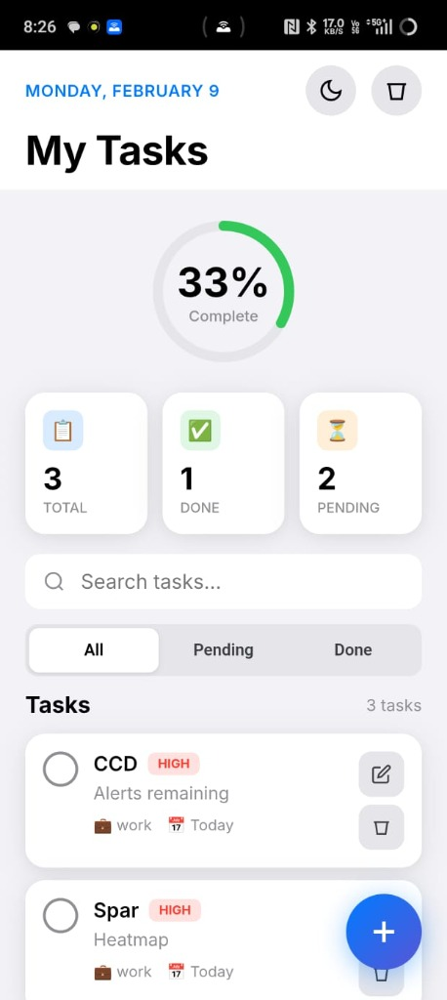
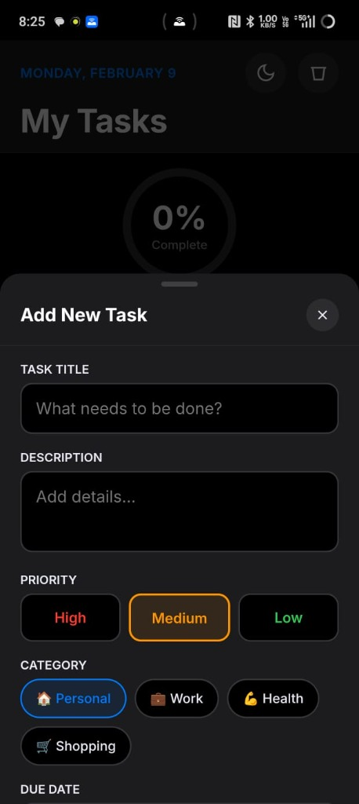
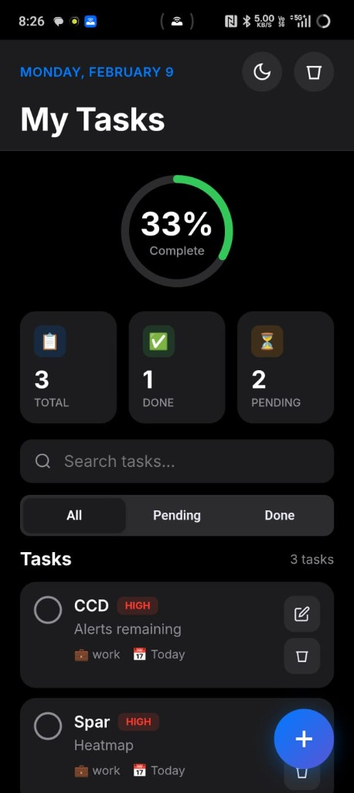

# 📱 Daily Tasks App

A beautiful iOS-style task manager Android app with dark/light mode, local data storage, and a clean modern interface.

<p align="center">
  
  
  
</p>

---

## 📥 Download & Install

### Direct APK Download
[](https://drive.google.com/file/d/1z3VRNZI2MTx3cwHy81bJxqPgp2uB6hU9/view?usp=sharing)

**[⬇️ Download APK from Google Drive](https://drive.google.com/file/d/1z3VRNZI2MTx3cwHy81bJxqPgp2uB6hU9/view?usp=sharing)**

> **Note:** Enable "Install from unknown sources" on your Android phone to install the APK.

---

## ✨ Features

| Feature | Description |
|---------|-------------|
| ✅ **Add/Edit/Delete Tasks** | Full task management |
| 🎯 **Priority Levels** | High, Medium, Low |
| 📂 **Categories** | Personal, Work, Health, Shopping |
| 📅 **Due Dates** | Set deadlines with smart labels |
| 🔍 **Search & Filter** | Find tasks quickly |
| 📊 **Progress Tracking** | Visual completion ring |
| 🌙 **Dark/Light Mode** | Easy on the eyes |
| 💾 **Offline Storage** | All data stored locally |
| 📱 **iOS-Style Design** | Premium look and feel |

---

## 🛠️ Tech Stack

| Technology | Purpose |
|------------|---------|
| HTML5/CSS3/JavaScript | App interface & logic |
| Capacitor | Web → Android wrapper |
| Android Studio | APK compilation |
| localStorage | Offline data storage |

---

## 🏗️ Build It Yourself

### Prerequisites
- [Node.js](https://nodejs.org/) (v16+)
- [Android Studio](https://developer.android.com/studio)

### Quick Start
```bash
# Clone the repo
git clone https://github.com/Ashutoshpatil04/Daily-Task-App.git
cd Daily-Task-App

# Install dependencies
npm install

# Open in Android Studio
npx cap open android
```

### Build APK
1. In Android Studio: **Build → Build Bundle(s) / APK(s) → Build APK(s)**
2. Find APK at: `android/app/build/outputs/apk/debug/app-debug.apk`

📖 See [BUILD_GUIDE.md](BUILD_GUIDE.md) for detailed instructions.

---

## 📸 Screenshots

### Light Mode
Beautiful clean interface with iOS-inspired design

### Dark Mode  
Easy on the eyes with OLED-friendly dark theme

### Add Task
Intuitive form with priority, category, and due date options

---

## 📁 Project Structure

```
Daily-Task-App/
├── android/           # Android native project
├── www/
│   └── index.html     # The app (HTML/CSS/JS)
├── screenshots/       # App screenshots
├── BUILD_GUIDE.md     # Detailed build instructions
├── capacitor.config.json
└── package.json
```

---

## 🤝 Contributing

1. Fork the repo
2. Create a feature branch (`git checkout -b feature/amazing-feature`)
3. Commit changes (`git commit -m 'Add amazing feature'`)
4. Push to branch (`git push origin feature/amazing-feature`)
5. Open a Pull Request

---

## 📄 License

This project is open source and available under the [MIT License](LICENSE).

---

## 👨‍💻 Author

**Ashutosh Patil**
- GitHub: [@Ashutoshpatil04](https://github.com/Ashutoshpatil04)

---

<p align="center">
  Made with ❤️ using HTML, CSS, JavaScript & Capacitor
</p>
